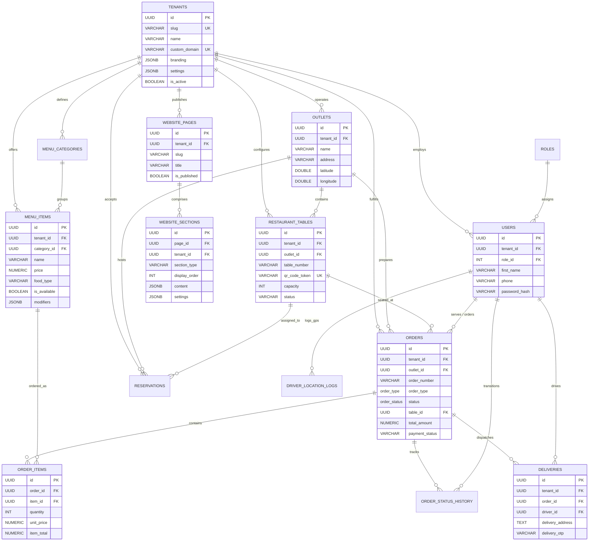

# Resto Platform - Database Entity Relationship Diagram (ERD)

```mermaid
erDiagram
    TENANTS ||--o{ OUTLETS : "operates"
    TENANTS ||--o{ USERS : "employs"
    TENANTS ||--o{ MENU_CATEGORIES : "defines"
    TENANTS ||--o{ MENU_ITEMS : "offers"
    TENANTS ||--o{ RESTAURANT_TABLES : "configures"
    TENANTS ||--o{ ORDERS : "fulfills"
    TENANTS ||--o{ RESERVATIONS : "accepts"
    TENANTS ||--o{ WEBSITE_PAGES : "publishes"

    OUTLETS ||--o{ RESTAURANT_TABLES : "contains"
    OUTLETS ||--o{ ORDERS : "prepares"
    OUTLETS ||--o{ RESERVATIONS : "hosts"

    ROLES ||--o{ USERS : "assigns"

    MENU_CATEGORIES ||--o{ MENU_ITEMS : "groups"

    RESTAURANT_TABLES ||--o{ ORDERS : "seated_at"
    RESTAURANT_TABLES ||--o{ RESERVATIONS : "assigned_to"

    ORDERS ||--o{ ORDER_ITEMS : "contains"
    ORDERS ||--o{ ORDER_STATUS_HISTORY : "tracks"
    ORDERS ||--o{ DELIVERIES : "dispatches"

    MENU_ITEMS ||--o{ ORDER_ITEMS : "ordered_as"

    USERS ||--o{ ORDERS : "serves / orders"
    USERS ||--o{ ORDER_STATUS_HISTORY : "transitions"
    USERS ||--o{ DELIVERIES : "drives"
    USERS ||--o{ DRIVER_LOCATION_LOGS : "logs_gps"

    WEBSITE_PAGES ||--o{ WEBSITE_SECTIONS : "comprises"

    TENANTS {
        UUID id PK
        VARCHAR slug UK
        VARCHAR name
        VARCHAR custom_domain UK
        JSONB branding
        JSONB settings
        BOOLEAN is_active
    }

    OUTLETS {
        UUID id PK
        UUID tenant_id FK
        VARCHAR name
        VARCHAR address
        DOUBLE latitude
        DOUBLE longitude
    }

    USERS {
        UUID id PK
        UUID tenant_id FK
        INT role_id FK
        VARCHAR first_name
        VARCHAR phone
        VARCHAR password_hash
    }

    RESTAURANT_TABLES {
        UUID id PK
        UUID tenant_id FK
        UUID outlet_id FK
        VARCHAR table_number
        VARCHAR qr_code_token UK
        INT capacity
        VARCHAR status
    }

    MENU_ITEMS {
        UUID id PK
        UUID tenant_id FK
        UUID category_id FK
        VARCHAR name
        NUMERIC price
        VARCHAR food_type
        BOOLEAN is_available
        JSONB modifiers
    }

    ORDERS {
        UUID id PK
        UUID tenant_id FK
        UUID outlet_id FK
        VARCHAR order_number
        order_type order_type
        order_status status
        UUID table_id FK
        NUMERIC total_amount
        VARCHAR payment_status
    }

    ORDER_ITEMS {
        UUID id PK
        UUID order_id FK
        UUID item_id FK
        INT quantity
        NUMERIC unit_price
        NUMERIC item_total
    }

    DELIVERIES {
        UUID id PK
        UUID tenant_id FK
        UUID order_id FK
        UUID driver_id FK
        TEXT delivery_address
        VARCHAR delivery_otp
    }

    WEBSITE_PAGES {
        UUID id PK
        UUID tenant_id FK
        VARCHAR slug
        VARCHAR title
        BOOLEAN is_published
    }

    WEBSITE_SECTIONS {
        UUID id PK
        UUID page_id FK
        UUID tenant_id FK
        VARCHAR section_type
        INT display_order
        JSONB content
        JSONB settings
    }
```
